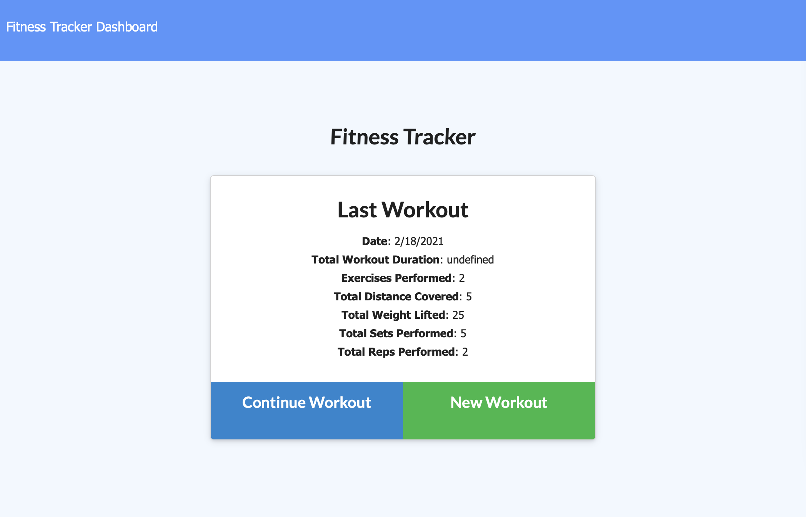
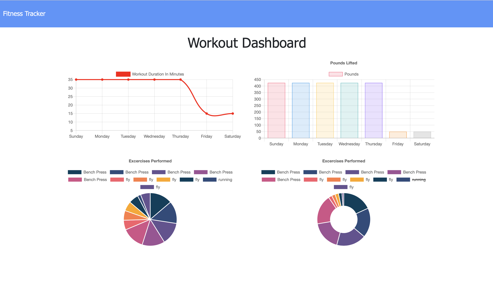

# FitnessTracker

## Description
This app will allow users to track their workout data, and save and display the stats of their past workouts. It demonstrates useage of MongoDB, Express.JS, and more. 

## Table of Contents

1. [Screenshot](#screenshot)
2. [How to Use](#usage)
3. [Questions](#questions)

## Screenshot

## How to Use

To use, simply navigate to the site and start entering workouts! [Link](https://fitness-tracker-cw.herokuapp.com)

## Questions

You can find my Github user profile [here.](https://github.com/calebkw91)
I can be reached by email at walke1291@gmail.com